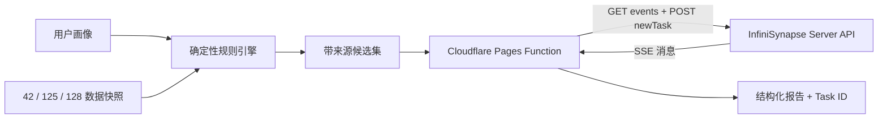

# OPC Gate · 一人公司政策与落地路线诊断

> **InfiniSynapse × CSDN Vibe Coding 2026 参赛作品**：将 42 个城市 / 适用范围、125 条政策和 128 条社区 / 载体样本转成可解释的一人公司选址建议。

[**立即体验**](https://opcgate.com) · [**36 秒真实 API 演示 / 最终参赛快照**](https://github.com/siuserxiaowei/opc-policy/releases/tag/vibe-coding-2026-final) · [**参赛架构与复现**](VIBE_CODING_2026.md) · [**城市对比**](https://opcgate.com/compare) · [**数据看板**](https://opcgate.com/dashboard)

[](https://opcgate.com)
[](VIBE_CODING_2026.md#真实调用证据)
[](#数据底座与来源口径)
[](https://opcgate.com/sitemap.xml)

OPC Gate 把用户画像和政策数据先交给确定性规则引擎，产生带来源的候选集；再通过服务端调用 InfiniSynapse Server API，综合成跨城市比较、机会证据、关键风险与七天行动计划。结果页展示真实 Task ID，可由赛事后台核验调用日志。

## 评委一分钟验证

1. 打开 [opcgate.com](https://opcgate.com)，点击「一键生成 AI 路线 · 约 60 秒」。
2. 系统会自动完成画像示例、规则筛选，并发起 InfiniSynapse Server API 分析。
3. 查看排序理由、来源、城市对比、证据风险、七天行动计划和可核验 Task ID。

已于 **2026-07-23（北京时间）**完成正式环境调用验证：服务端先建立 `GET /api/ai/events` SSE，再通过 `POST /api/ai/message` 创建 `newTask`，最后将结构化报告与 Task ID 流式返回前端。可核验 Task ID：`850b9073-e8d9-49cb-9d03-9434f1f76a68`。

API 实现对照 [InfiniSynapse Server API Reference](https://infinisynapse.cn/zh/docs/InfiniSynapse%20Server%20API%20Reference)，文档页面标注最后更新于 2026-07-22。

## 为什么适合泛数据分析赛题

| 分析链路 | OPC Gate 实现 | 可核验输出 |
| --- | --- | --- |
| 数据建模 | 政策、城市、社区 / 载体的结构化 JSON | 42 / 125 / 128 及 schema |
| 确定性筛选 | 按城市、阶段、行业、团队和需求组合评分 | 排序、匹配理由、申报时间 |
| 来源约束 | 官方原文优先；官链缺失时明示参考来源 | 页面来源标签和原文链接 |
| AI 综合 | InfiniSynapse 对候选集进行跨城比较 | 证据、置信度、风险与行动计划 |
| 结果追溯 | Cloudflare Pages Function 代理正式 API | 前端 Task ID + InfiniSynapse `ALL TASKS` |

## 时间口径：项目基础 vs 参赛冲刺

本仓库在本次赛事前已有政策导航、规则匹配和数据集，**不是 2026-07-22 从零创建的新仓库**。本次 Vibe Coding 冲刺于 **2026-07-22 至 2026-07-23** 在现有产品上真实完成 AI 分析链路、服务端 API 代理、安全与流式输出加固、正式环境录制及参赛复现材料。

| 日期 | 可核验提交 | 实际新增 / 改进 |
| --- | --- | --- |
| 2026-07-22 21:00 | [`6f663cc`](https://github.com/siuserxiaowei/opc-policy/commit/6f663cc) | InfiniSynapse 报告链路、Pages Function、输入约束与 fail-closed、参赛展示和自动化测试 |
| 2026-07-23 11:07 | [`0f0abab`](https://github.com/siuserxiaowei/opc-policy/commit/0f0abab) | `newTask` 业务错误校验、SSE 增量文本合并和更完整的回归测试 |
| 2026-07-23 11:47 | [`15f5b12`](https://github.com/siuserxiaowei/opc-policy/commit/15f5b12) | 录制脚本改为访问 `opcgate.com` 正式站并等待真实 Server API 返回 |
| 2026-07-23 12:15 | [`83f61ad`](https://github.com/siuserxiaowei/opc-policy/commit/83f61ad) | 公开参赛架构、Task ID 证据、验证结果和复现命令 |
| 2026-07-23 13:59–14:19 | [`83f61ad...a2207ed`](https://github.com/siuserxiaowei/opc-policy/compare/83f61ad...a2207ed) | 将首页调整为评委一分钟验证流程，校准数据口径与开发日志，更新部署产物并增加参赛社交预览图 |

> 日期来自 Git 提交记录；未改写旧提交时间，也不把赛前已有功能写成赛事期间新建。

`vibe-coding-2026` 保留为演示录制时的可追溯快照；[`vibe-coding-2026-final`](https://github.com/siuserxiaowei/opc-policy/releases/tag/vibe-coding-2026-final) 指向最终参赛源码、演示视频和复现说明。

## 数据底座与来源口径

- **数据快照日期：2026-05-22**，以 `data/policies.json` 和 `data/communities.json` 顶层 `updated_at` 为准。这与 2026-07-23 的产品 / API 构建日期是两个不同口径。
- **42 个城市 / 适用范围**：`data/cities.json`。其中「全国」是适用范围，不会在 AI 报告中被当作城市推荐。
- **125 条政策记录**：`data/policies.json`；其中 106 条填有 `links.official` 主来源字段，按当前前端官方域名白名单会展示 99 条「官方来源」与 26 条参考 / 缺官链记录。
- **128 条社区 / 载体样本**：`data/communities.json`。「样本」表示数据集记录，不等同于全国完整名录。
- **188 个 sitemap URL**：当前 `sitemap.xml` 中 `<url>` 节点数，对应主页、工具页、城市页和政策详情页。

来源展示遵循「**官方原文优先，缺失必须明示**」：

1. `links.official` 存在且通过前端官方域名白名单时，页面标记「官方来源」。字段名本身不被当作官方性证明。
2. 官链缺失时，页面标记「参考来源」或「已核验 · 缺官链」，不把媒体 / 资讯链接冒充政策原文。
3. 给 InfiniSynapse 的候选项保留来源字段；缺少官链时提示降低 `confidence` 并需人工核验。

数据仅用于信息查询和路线诊断，最终申请以主管部门最新原文和书面答复为准。

## 核心能力

| 能力 | 入口 | 用途 |
| --- | --- | --- |
| 规则匹配 + AI 深度研判 | [首页](https://opcgate.com) | 生成候选排序、跨城比较、证据风险和行动计划 |
| 城市横向对比 | [compare](https://opcgate.com/compare) | 对比补贴、社区、税务和申报门槛 |
| 数据看板 | [dashboard](https://opcgate.com/dashboard) | 查看城市覆盖、补贴分布、申报日历和榜单 |
| 城市深页 | [seo/cities](https://opcgate.com/seo/cities) | 查看单城政策、载体与来源 |
| 开放申报窗口 | [now-open](https://opcgate.com/now-open) | 按 schedule 字段查看当前 / 近期机会 |
| 变更追踪 | [changelog](https://opcgate.com/changelog) · [RSS](https://opcgate.com/rss.xml) | 追踪公开数据变更 |

## 技术架构



浏览器只将用户画像和候选数据提交给本站后端。`INFINISYNAPSE_API_KEY` 只保存在 Cloudflare Pages Secret，不进入 HTML、JavaScript 或 Git。未配置密钥时，API 返回 `503 INFINISYNAPSE_NOT_CONFIGURED`，确定性规则匹配仍可用。

关键路径：

```text
index.html                           # 首页、规则匹配与 AI 报告 UI
functions/api/infinisynapse-report.js # InfiniSynapse 服务端代理
data/                                # policies / cities / communities / schema
assets/js/schedule.js                # 申报窗口计算
tests/unit/                           # API 输入、SSE、错误处理测试
tests/e2e/                            # 核心流程和正式站录制脚本
scripts/validate_data.py             # 数据结构与来源校验
VIBE_CODING_2026.md                  # 参赛架构、证据与复现
```

## 本地运行与验证

需要 Node.js 18 或更高版本。

```bash
git clone https://github.com/siuserxiaowei/opc-policy.git
cd opc-policy
npm ci
npm run test:unit
python3 scripts/validate_data.py
```

安装 Playwright Chromium 后可执行全部测试：

```bash
npm run test:e2e:install
npm test
./scripts/deploy.sh --skip-check --skip-generate --dry-run
```

`opcgate.com` 使用 Cloudflare Pages + Pages Functions，是含 InfiniSynapse 服务端调用的正式参赛环境。GitHub Pages workflow 只发布白名单构建产物作静态预览，不代替正式站的 Pages Function。

本地联调 InfiniSynapse 时，复制 `.dev.vars.example` 为 `.dev.vars` 并填入自己的密钥；不要将 `.dev.vars`、API Key、token、cookie 或账号凭据提交到仓库。

## 开源、反馈与联系

- 作者：**siuser 小伟**（产品 + 开发）
- 数据纠错 / 功能建议：[GitHub Issues](https://github.com/siuserxiaowei/opc-policy/issues)
- 产品交流：微信 `siuserxiaowei`（备注 OPC）

代码按 MIT 方式开放使用；政策和载体数据请保留 `opcgate.com` 来源标注，并回到官方原文核验。
