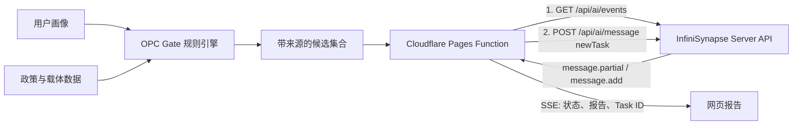

# OPC Gate · Vibe Coding 2026 参赛说明

OPC Gate 是面向一人公司创业者的政策信息查询与落地路线诊断工具。本次参赛版本把原有的确定性规则匹配与 InfiniSynapse Server API 组合起来：规则引擎负责筛选、解释和保留官方来源，InfiniSynapse 负责跨城市综合证据、风险和行动计划。

## 一分钟体验

1. 打开 [https://opcgate.com](https://opcgate.com)。
2. 点击「开始路线诊断」，或直接选择「用示例填充」。
3. 完成规则匹配后，点击「生成 AI 深度选址报告」。
4. 查看推荐城市、机会证据、关键风险、七天行动计划和真实 Task ID。

演示视频：[GitHub Release](https://github.com/siuserxiaowei/opc-policy/releases/tag/vibe-coding-2026)

## 为什么适合泛数据分析赛题

- 数据底座：42 个城市 / 适用范围、125 条政策、128 条园区与社区记录。
- 可解释筛选：先用确定性规则对城市、阶段、行业、团队规模和需求做匹配。
- 证据约束：候选项携带官方或参考来源；缺少官链时自动降低置信度并提示人工核验。
- AI 综合：将规则候选和用户画像交给 InfiniSynapse，生成跨城市比较与执行路线。
- 可追溯：前端展示 Task ID，赛事方可在平台后台核验调用记录。

## 调用架构



关键实现位于 [`functions/api/infinisynapse-report.js`](functions/api/infinisynapse-report.js)：

- 服务端预生成 `taskId` 与 `connId`。
- 严格遵循官方文档要求，先建立 SSE，再发送 `newTask`。
- 消费 `message.partial`、`message.add`、`message.update` 和 `completion_result`。
- 对输入长度、候选数量、URL 协议与输出结构做边界约束。
- API Key 只保存在 Cloudflare Pages Secret，不进入浏览器代码或 Git。
- 上游未配置、业务失败、解析失败和断连均 fail closed，不伪造 AI 结果。

## 真实调用证据

- 验证日期：2026-07-23（北京时间）
- 正式环境：[https://opcgate.com](https://opcgate.com)
- InfiniSynapse Task ID：`850b9073-e8d9-49cb-9d03-9434f1f76a68`
- 后台状态：任务已出现在账号的 `ALL TASKS` 列表并返回完整结构化报告
- 返回内容：推荐城市、城市适配比较、机会证据、风险、行动计划与适用边界

Task ID 仅用于赛事核验；API Key、会话凭据和账号资料不会写入仓库。

## 验证结果

2026-07-23 参赛构建验证：

```text
Unit tests       7 passed
Playwright E2E   7 passed
Policies         125
Communities      128
Cities           42
Data errors      0
Data warnings    0
```

复现命令：

```bash
npm install
npm test
python3 scripts/validate_data.py
./scripts/deploy.sh --skip-check --skip-generate --dry-run
```

## 技术栈

- 原生 HTML / CSS / JavaScript
- Cloudflare Pages + Pages Functions
- InfiniSynapse Server API（SSE + `newTask`）
- Node.js 测试 + Playwright E2E
- ChatCut 演示视频：大壹旁白、字幕逐词高亮、背景音乐自动 duck、轻推近效果

## 使用边界

OPC Gate 提供政策信息查询和路线诊断参考，不构成法律、税务、补贴或申报成功承诺。最终申请应以主管部门最新原文和书面答复为准。
