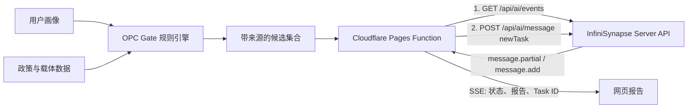

# OPC Gate · Vibe Coding 2026 参赛说明

OPC Gate 是面向一人公司创业者的政策信息查询与落地路线诊断工具。本次参赛版本把原有的确定性规则匹配与 InfiniSynapse Server API 组合起来：规则引擎负责筛选、解释和保留官方来源，InfiniSynapse 负责跨城市综合证据、风险和行动计划。

> **时间口径**：本仓库在赛前已有政策导航、数据集和规则匹配；本次 Vibe Coding 冲刺是 2026-07-22 至 2026-07-23 完成的 AI 分析链路、Server API 服务端接入、安全与 SSE 加固、正式站录制和参赛复现材料。政策 / 载体数据快照仍以文件中的 **2026-05-22** `updated_at` 为准，不与 2026-07-23 的产品 / API 构建日期混用。

## 一分钟体验

1. 打开 [https://opcgate.com](https://opcgate.com)。
2. 点击「一键体验示例 · 约 60 秒」，自动填入画像并完成规则匹配。
3. 查看候选、来源与可核验上限后，点击「生成 AI 深度选址报告」。
4. 查看推荐城市、机会证据、关键风险、七天行动计划和真实 Task ID。

演示视频：[GitHub Release](https://github.com/siuserxiaowei/opc-policy/releases/tag/vibe-coding-2026)

## 为什么适合泛数据分析赛题

- 数据底座：42 个城市 / 适用范围、125 条政策、128 条园区与社区样本，并生成 188 个 sitemap URL。
- 可解释筛选：先用确定性规则对城市、阶段、行业、团队规模和需求做匹配。
- 证据约束：候选项携带官方或参考来源；缺少官链时自动降低置信度并提示人工核验。
- AI 综合：将规则候选和用户画像交给 InfiniSynapse，生成跨城市比较与执行路线。
- 可追溯：前端展示 Task ID，赛事方可在平台后台核验调用记录。

## 数据与官方来源口径

- 数据快照：`data/policies.json` 与 `data/communities.json` 的 `updated_at` 均为 **2026-05-22**。
- 政策来源：125 条政策中，106 条填有 `links.official` 主来源字段；按当前前端域名白名单，99 条展示为「官方来源」，26 条展示为参考 / 缺官链。
- 展示规则：主来源通过官方域名白名单时标记「官方来源」；否则标记「参考来源」或「已核验 · 缺官链」。字段名本身不被当作官方性证明，也不把媒体链接冒充政策原文。
- AI 规则：缺少官方链接的候选必须降低 `confidence`，并在 `limitations` 中提示人工核验。

## 调用架构



关键实现位于 [`functions/api/infinisynapse-report.js`](functions/api/infinisynapse-report.js)：

- 服务端预生成 `taskId` 与 `connId`。
- 对照 [InfiniSynapse Server API Reference](https://infinisynapse.cn/zh/docs/InfiniSynapse%20Server%20API%20Reference)，先建立 SSE，再发送 `newTask`。
- 消费 `message.partial`、`message.add`、`message.update` 和 `completion_result`。
- 对输入长度、候选数量、URL 协议与输出结构做边界约束。
- API Key 只保存在 Cloudflare Pages Secret，不进入浏览器代码或 Git。
- 上游未配置、业务失败、解析失败和断连均 fail closed，不伪造 AI 结果。

## 真实调用证据

- 验证日期：2026-07-23（北京时间）
- 正式环境：[https://opcgate.com](https://opcgate.com)
- InfiniSynapse Task ID：`850b9073-e8d9-49cb-9d03-9434f1f76a68`
- 后台状态：任务已出现在账号的 `ALL TASKS` 列表并返回完整结构化报告
- 返回内容：推荐城市、城市适配比较、机会证据、风险、行动计划与适用边界

Task ID 仅用于赛事核验；API Key、会话凭据和账号资料不会写入仓库。

演示视频是正式站实际流程，录制脚本默认访问 `https://opcgate.com`，并等待真实 API 返回；录制时接口未被拦截，报告也未由脚本注入。

## 2026-07-22 至 2026-07-23 Vibe Coding 冲刺日志

| 时间（北京时间） | Git 证据 | 真实完成内容 |
| --- | --- | --- |
| 2026-07-22 21:00 | [`6f663cc`](https://github.com/siuserxiaowei/opc-policy/commit/6f663cc) | 接入 InfiniSynapse Server API，增加 Pages Function、输入约束、fail-closed、报告 UI、单元与 E2E 测试 |
| 2026-07-23 11:07 | [`0f0abab`](https://github.com/siuserxiaowei/opc-policy/commit/0f0abab) | 加固 `newTask` 业务失败处理和 SSE 增量消息合并，增加回归测试 |
| 2026-07-23 11:47 | [`15f5b12`](https://github.com/siuserxiaowei/opc-policy/commit/15f5b12) | 录制脚本切到 `opcgate.com` 正式站，并等待真实 Server API 报告返回 |
| 2026-07-23 12:15 | [`83f61ad`](https://github.com/siuserxiaowei/opc-policy/commit/83f61ad) | 公开参赛架构、正式 Task ID、验证结果和复现命令 |

日志只根据已存在的 Git 提交整理，没有改写历史日期，也没有将赛前已有的数据底座写成赛事期间新建。

## 验证结果

2026-07-23 参赛构建验证：

```text
Unit tests       7 passed
Playwright E2E   8 passed
Policies         125
Communities      128
Cities           42
Sitemap URLs      188
Data errors      0
Data warnings    0
```

复现命令：

```bash
npm install
npm test
python3 scripts/validate_data.py
./scripts/deploy.sh --skip-check --skip-generate --dry-run
```

## 技术栈

- 原生 HTML / CSS / JavaScript
- Cloudflare Pages + Pages Functions
- InfiniSynapse Server API（SSE + `newTask`）
- Node.js 测试 + Playwright E2E
- ChatCut 演示视频：大壹旁白、字幕逐词高亮、背景音乐自动 duck、轻推近效果

## 使用边界

OPC Gate 提供政策信息查询和路线诊断参考，不构成法律、税务、补贴或申报成功承诺。最终申请应以主管部门最新原文和书面答复为准。
